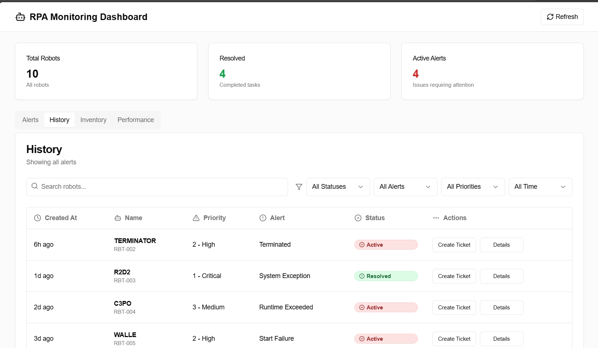
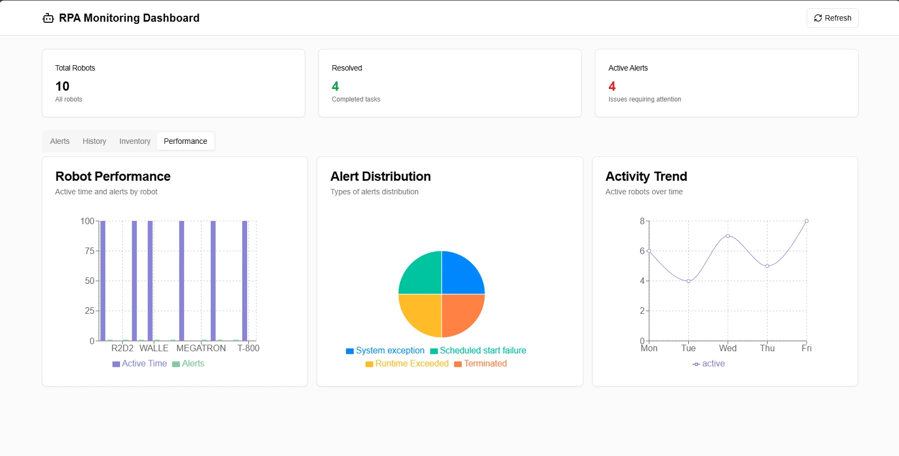

# Proactive Monitoring Dashboard

> Real-time RPA operations monitoring system. Built at ITAÚ Bank, serving 120+ ops users across 4 dashboards. Reduced incident response time by 35% through centralized KPI visibility.

A proactive monitoring system for RPA (Robotic Process Automation) processes designed to provide real-time visibility into robot execution, analyze performance, generate automatic alerts, and improve operational traceability across automation workflows.

## Impact

| Metric                              | Value                                  |
| ----------------------------------- | -------------------------------------- |
| Operations users served             | **120+**                               |
| Real-time dashboards shipped        | **4**                                  |
| Incident response time reduction    | **-35%**                               |
| RPA pipelines monitored             | **4**                                  |

## How it works

1. **RPA Event Logging** — Robots write execution logs directly into PostgreSQL during their run.
2. **Data Processing** — Stored procedures, triggers, and ETL jobs detect failures, exceptions, and critical patterns, populating the `alerts` table.
3. **Real-Time Visualization** — The web platform queries the database to render:
   - Live alert feed with severity routing
   - Execution history and drilldowns
   - Robot inventory and ownership
   - Performance / failure analysis charts

## Screenshots

### Alert History Panel


### Performance Panel


## Architecture

```
+---------------+     +----------------+     +-------------------+
|   RPA Bots    | --> |   PostgreSQL   | --> |   ETL + Triggers  |
|   (logs)      |     |   (raw + alert)|     |   (alert routing) |
+---------------+     +----------------+     +-------------------+
                                                     |
                                                     v
+-------------------+      +---------------------+
|   Next.js + React | <--- |   Express REST API  |
|   Dashboards (4)  |      |   (typed endpoints) |
+-------------------+      +---------------------+
```

## Tech Stack

### Frontend
- **Next.js 14** · **React 18** · **TypeScript**
- **Tailwind CSS** · **Shadcn/ui**
- **Recharts** (real-time KPI visualizations)

### Backend
- **Node.js** · **Express.js** · **TypeScript**
- **PostgreSQL** · **Sequelize ORM**
- **Stored procedures** + triggers for alert detection

### Tooling
- **Supabase** for auth + database hosting
- **Swagger / OpenAPI** for API documentation
- **Jest** for testing

## Context

Built at ITAÚ Bank (08/2024 – 04/2025) as part of the Operations RPA platform. The dashboards replaced a mix of email alerts and manual spreadsheet reports for 120+ ops users; the 35% incident response reduction came from giving operators a single live view instead of reactive postmortems.

Featured in my portfolio — see [renatolagos.com](https://renatolagos.com) for the broader work.

---

**Author**: Renato Lagos · [renatolagos.com](https://renatolagos.com) · Backend / AI Engineer · Berlin
